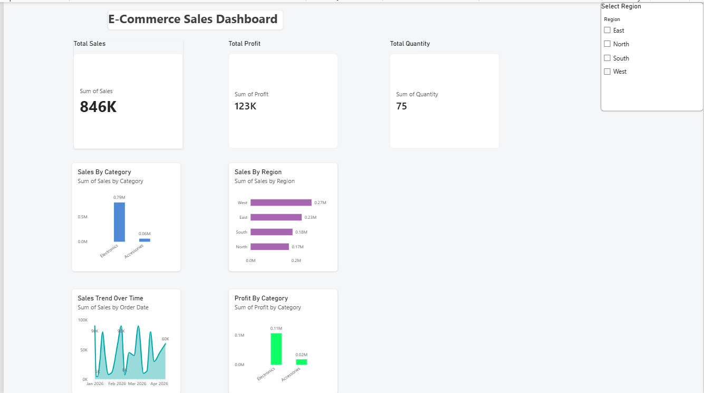

# Ecommerce Sales Analysis

## Project Overview
An interactive E-commerce Sales Analysis Dashboard developed using Power BI and Excel to analyze sales performance and identify key business insights.

## Tools & Technologies
- Power BI
- Microsoft Excel
- Data Analysis
- Data Visualization

## Dashboard

## Key Analysis
- Sales performance analysis
- Sales trend analysis
- Category-wise sales analysis
- Customer and product performance analysis
- Interactive dashboard visualizations

## Project Files
- `ecommerce.pbix` – Power BI dashboard project
- `dashboard.png` – Dashboard preview
- `README.md` – Project documentation

## Skills Demonstrated
- Data Cleaning
- Data Analysis
- Data Visualization
- Dashboard Development
- Microsoft Excel
- Power BI
